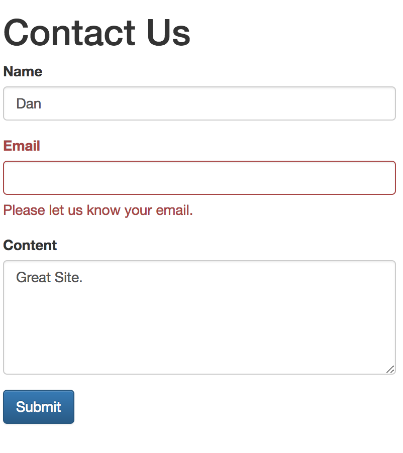

# A Contact Form with Spring Step-by-Step
## HTML Forms

Below is a simple contact form. It consists of opening and closing `form` tags and one or more `input` elements. 

```html
<form action="/path" method="post" class="form">
    <label for="name">Name</label>
    <input type="text" id="nameField" name="name"/>
	<button type="submit" class="btn btn-primary">Submit</button>
</form>
```

**Note to self:** `input` elements need to have a `name` attribute. Whe the form content is submitted, key-value pairs from `name` and the corresponding user input are put together. _That is what I had been missing in the lecture!_ And without the name, the user input could not be matched to a key...

Such a form is complete except for one thing - a CSRF token, which brings us to...

### CSRF protection
Here more about [Cross-Site Request Forgery (CSRF)](https://www.owasp.org/index.php/Cross-Site_Request_Forgery_(CSRF)). Long story short, a CSRF token prevents a malicious person from abusing session cookies stored on your computer by adding to (POST/PUT/DELETE/PATCH) requests an additional piece of information that is specific to your session but is not a cookie.

If you let it, Spring will automatically insert a CSRF token into forms for you.

You do this by using the `th:action="@{` attribute in the `form` tag:

```html
<form th:action="@{/contactSubmit}" method="post" class="form">
```
Instead of the target path (`/contactSubmit`) in verbatim as in the first example above.

So here our complete contact form. 

```html
<form th:action="@{/contactSubmit}" method="post" class="form">

    <div class="form-group blu-margin">
        <label for="name">Name</label>
        <input type="text" id="name" name="name"/>
    </div>
    <div class="form-group">
        <label for="email">Email</label>
        <input type="email" id="email" name="email"/>
    </div>
    <div class="form-group">
        <label for="body">Content</label>
        <textarea class="form-control" rows="5" id="body" name="body"></textarea>
    </div>

    <button type="submit" class="btn btn-primary">Submit</button>

</form>
```

## Server Side
Once we have the template complete and stored in the `resource/templates` folder we can deal with the handler functions. On the server we need to have two end points:

1. a GET handler one for sending our contact form to the client in an inital request
2. a POST handler to deal with the contents of the form

### GET Handler

Because the contact form needs to processing and can be sent out as is, we can just register it with the default view controller as :

```java
@Override
public void addViewControllers(ViewControllerRegistry registry) {
	registry.addViewController("/contact");
    ...
}
```

#### Whitelist in Security Controller
In order for visitors to our page to contact us without login we need to whitelist the path in our `WebSecurityConfig`.

```java
protected void configure(HttpSecurity http) throws Exception {
	http
        .authorizeRequests()
        // allow browsing index
        .antMatchers("/", "/terms", "/contact", "/contactSubmit").permitAll()
    
```

### POST Handler
A POST handler function is any ordinary function, decorated with either 

* `@PostMapping("/path")` or
* `@RequestMapping(value = "/path", method = RequestMethod.POST)`

(there are equivalent GET handler annotations available)

Spring will provide the request data to you as annotated parameters to the method.

The most primitive option is to access the raw POST payload data through the `@RequestBody` annotation:

```java
@PostMapping(value = "/contactSubmit")
    public String contact(@RequestBody String contact) {
    logger.info(String.valueOf(contact));
    return "index";
}
```

If we entered our name and email we would see something like following in the log output
`name=Daniel+Schien&email=daniel.schien%40bristol&body=ASD&_csrf=04c9a1e7-cdb6-408a-a0fb-0d1a16393413
` ... note the CSRF token...

This is the default html form encoding. The alternative would be `application/json` if your client were sending  JSON. Spring does a good job at detecting the encoding for you. You can manual control what encoding your handler function consumes with attributes to the `@PostMapping` annotation.

```java
@PostMapping(value = "/contactSubmit", consumes = MediaType.APPLICATION_FORM_URLENCODED_VALUE)
```

### Data Binding

More convenient than iterating over the key-value pairs from the form is having Spring bind the request data to an Entity object for you. For that to work you need an Entity with properties corresponding to the keys in your form.

```java
@PostMapping(value = "/contactSubmit")
public String submitContact(@ModelAttribute ContactRequest contact) {
    logger.info(String.valueOf(contact.getName()));
    return "index";
}
```

### Repositories
With Entities completely populated with might as well store it in our `CRUDRepository`

```java
@Autowired
private ContactRequestRepository contactRepository;

@PostMapping(value = "/contactSubmit")
public String submitContact(@ModelAttribute ContactRequest contact) {
    contactRepository.save(contact);
    return "index";
}
```

### Redirects
It is good practice to [redirect after a post](https://en.wikipedia.org/wiki/Post/Redirect/Get) submission to make it less likely that users submit a form twice.

We can achieve that with `return "redirect:/contact";` as the return value in our post handler.

### Success Message
We might also want to display a message when the contact request was received and stored.

We can achieve that by add `RedirectAttributes` to our post handler before we do the redirect

```java
@PostMapping(value = "/contactSubmit")
    public String submitContact(@Valid ContactRequest contact, RedirectAttributes attr) {
        contactRepository.save(contact);
        attr.addFlashAttribute("message", "Thank you for your message. We'll be in touch ASAP");
        return "redirect:/contact";
    }
```

And we also need to add a place in the form to display it. 

```html
<form ...>
	<span th:text="${message}" class="text-success"></span>
	...
</form>
```
This will tell thymeleaf to show any messages. It will not show up if there are no messages.

### Validation

Finally, you will want to automatically validate your user input. 

You can achieve that with annoations on your Entities. For example `NotEmpty` annotations below do what you would expect.

```java
@Entity
public class ContactRequest {

    @Id
    @GeneratedValue
    private Long id;

    @NotEmpty(message = "Please enter your name.")
    String name;
    @NotEmpty(message = "Please let us know your email.")
    @Email
    String email;
    @NotEmpty
    String body;
```

In addition for the validation errors to be displayed client side we need to bind our form to a java object instance (create a "bean backed form"). Two steps are required:

* add a bean to our form get handler
* add thymeleaf expressions to our form html template

The first step requires that we add an explict GetMapping for our `/contact` path (instead of the `ViewControllerRegistry` above).

```java
@GetMapping("/contact")
public String showContactForm(ContactRequest contact) {
    return "contact";
}
```

The modifications to our template include adding a `th:object` reference that refers to a bean **type** (in this case ContactRequest). And binding of individual fields `th:field="*{}"`

```html
<form th:action="@{/contact}" th:object="${contactRequest}" method="post" class="form">

	<div class="form-group">
	    <label for="name">Name</label>
	    <input type="text" id="name" th:field="*{name}"/>	
	</div>
	...
```

Note I also changed the form action path to `contact` because we now have explicit GET and POST handlers that can serve the same path.

We also need to update our POST handler to not save in the presence of errors but redirect to our GET handler (which will include the bound, incomplete ContactRequest bean).

```java
 @PostMapping(value = "/contact")
public String submitContact(@Valid ContactRequest contact, BindingResult binding, RedirectAttributes attr) {
    if (binding.hasErrors()) {
        return "/contact";
    }
    contactRepository.save(contact);
    attr.addFlashAttribute("message", "Thank you for your message. We'll be in touch ASAP");
    return "redirect:/contact";
}
```

### Style

The final bit of sugar is to highlight errors with a bit of colour. Bootstrap does that for us nicely.

The form html does become a bit hard to read, I admit, but it looks good to the user.

{:width="236px"}

```html
<form th:action="@{/contact}" th:object="${contactRequest}" method="post" class="form" role="form">
    <span th:text="${message}" class="text-success"></span>

    <div class="form-group" th:classappend="${#fields.hasErrors('name')} ? has-error : blu-margin">
        <label class="control-label" for="name">Name</label>
        <input type="text" id="name" class="form-control" th:field="*{name}"/>
        <span th:if="${#fields.hasErrors('name')}" th:errors="*{name}" class="help-block"></span>
    </div>
    <div class="form-group" th:classappend="${#fields.hasErrors('email')} ? has-error : blu-margin">
        <label class="control-label" for="email">Email</label>
        <input type="email" id="email" th:field="*{email}" class="form-control"/>
        <span th:if="${#fields.hasErrors('email')}" th:errors="*{email}" class="help-block"></span>
    </div>
    <div class="form-group" th:classappend="${#fields.hasErrors('body')} ? has-error : blu-margin">
        <label class="control-label" for="body">Content</label>
        <textarea class="form-control" rows="5" id="body" th:field="*{body}"></textarea>
        <span th:if="${#fields.hasErrors('body')}" th:errors="*{body}" class="help-block"></span>
    </div>

    <button type="submit" class="btn btn-primary">Submit</button>

            </form>
```